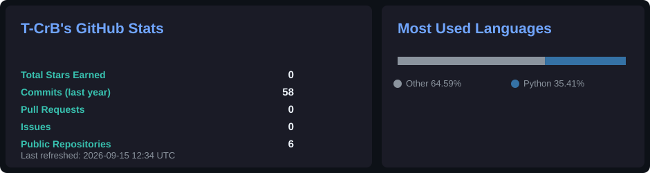
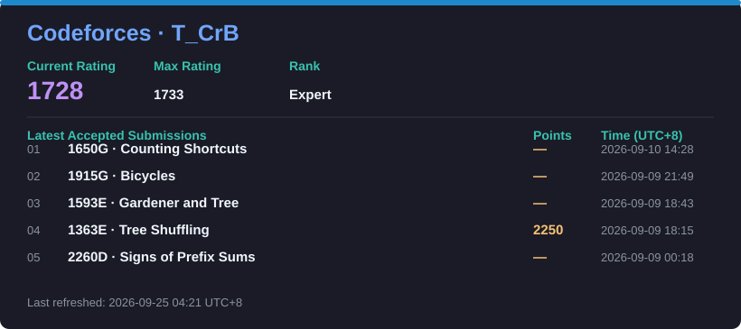

<h2 align="center">👋 Hi, I'm T-CrB</h2>

  

  
  

---

## 🛠️ Tech Stack

  

---

## 📊 GitHub Stats

  

---

## ⭐ Codeforces

  

  Updated automatically from the Codeforces API every 30 minutes.

---

  

